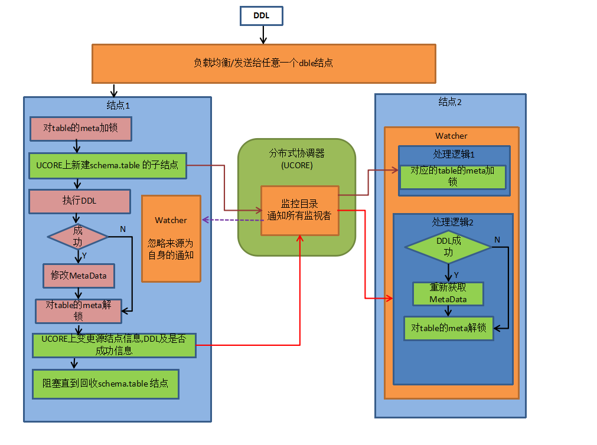
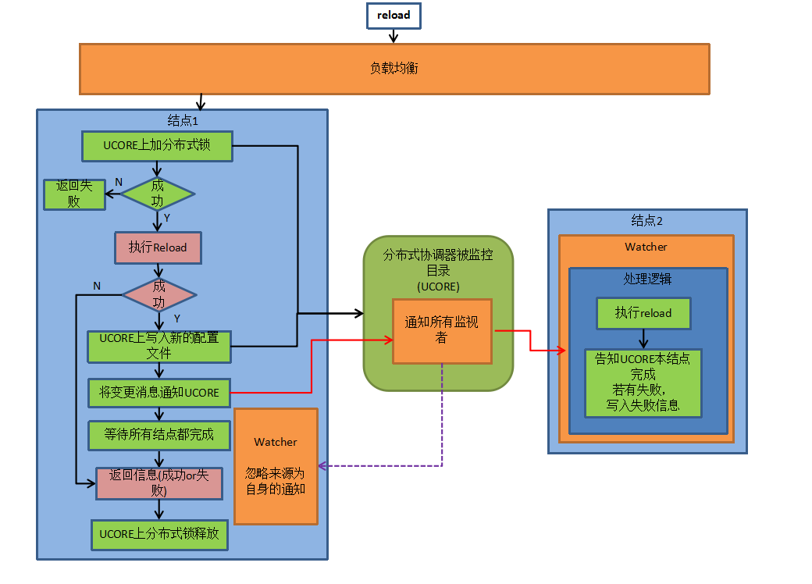

# Dble的UCORE集群
##一 UCORE初始化 
UCORE作为商业项目原则上不会出现和dble单独组合成为集群的状态，一般情况下UCORE集群的初始化会由其他组件调用脚本init_ucore_data.sh进行，脚本可输入两个参数，手动执行时如下  
sh init_ucore_data.sh {DBLE_HOME} {JAVA_HOME}
## 二 状态同步(UCORE)
### A.DDL
做DDL的时候会先获取到对应的分布式表锁，然后再执行对应的SQL语句，最后根据执行的结果进行通知其他节点的更新。流程如下图：

注：

1.回收指的是：每个节点ddl完成后会告知分布式协调器自己已经完成，并检查如果所有结点均完成，则删除schema.table 结点。此操作为原子操作。  

2.逻辑上不应该有某个节点上加载meta失败的情况，如果发生了，告警处理

3.发起者下线问题(依赖监控online 状态)
如果发起DDL的节点下线，则其他节点会去清空对应的tablekey，并且释放自身的对应的锁

### B.reload @@config/ reload @@config_all/ rollback @@config
执行流程如下图：

 

### C.拉取一致性的binlog线
#### 目的:
获得后端数据库实例的一致性binlog位置。由于两阶段提交的第二阶段执行在各结点无法保证时序性和同步性，所以直接下发show master status获取binlog可能会造成不一致。  
#### 实现方式：
如下图，当前端收到show @@binlog.status 语句时，遍历当前所有活动session查看状态 。  
若session处于绿色区域，则在进入红色区域前等待知道show @@binlog.status结果返回  
若存在session处于红色区域，则需要等待所有红色区域的session返回结果走出红色区域后下发show master status。  

#### 超时处理：
此处有可能有死锁发生。  
场景:session1 正在更新tableA，处于绿色区域，session2下发有关于tableA 的DDL，等待  metaLock解锁，处于红色区域.session3 下发show @@binlog.status.  
此时session1 等待session3, session2等待session1,session3等待session2.  
因此引入超时机制。如果session3 等待超过showBinlogStatusTimeout(默认60s，可配置)，自动放弃等待，环状锁解除。  
#### 集群协调：
1.收到请求后同步通知UCORE，先等待本身结点准备工作结束，之后UCORE通知其他结点处理。  
2.所有结点遍历各自的活动的session，进入红色区域的等待处理完成，绿色区域的暂停进入红色区域。  
3.结点将准备好/超时将状态上报给UCORE
4.主节点等待所有结点状态上报完成之后，判断是否可以执行任务，若是,则执行show   @@binlog.status并返回结果，否则报告本次执行失败。  
5.主节点通过UCORE通知各结点继续之前的任务  

#### 集群超时处理：
若有结点超时未准备好，主节点会报超时错误，并通过UCORE通知各结点继续之前的任务。

#### 故障处理：
主节点执行过程中故障下线，其他结点会感知，保证自己结点一定时间后自动解锁继续原有任务，并且会尝试删除遗留的状态信息 

### D.其他(暂未实现)
cache配置变化（暂未实现专门入口）:  
reload 时会将变化写入UCORE并通知其他结点同步   
XA日志的UCORE集群化
新增自增序列表（暂未实现专门入口）：  
reload未比对并添加新表的配置，  
包括sequence_conf.properties  和sequence_db_conf.properties 方式  
 
## 四 UCORE整体目录结构
+ universe/dble/cluster-id  
   - cache
     + ehcache.xml(ehcache.xml文件的json信息)
   - conf
     + status(DBLE reload状态)
       - serverId（reload响应serverId）
     + lock
       - confChange.lock（reload锁）
       - binlogStatus.lock（binloagStatus锁）
     + binlog_pause
        - status
          + serverId(已经完成binlog pause的server)
     + rules(rule.xml以及其他附属文件的json信息)
     + schema(schema.xml的json信息)
     + sequences(包括sequence_conf，sequence_db_conf，cacheservice，sequence_distributed_conf)
     + server(server.xml的json信息)
   - online
     + serverId(myid中的)
   - view
     + update 
       - schema.view (视图变更通知) [serverId;变更类型]
         + serverId(已响应serverid)
     + schema.view（具体的视图信息）[create sql]
   - ddl
     + schema.view (ddl表格变更通知)[schema;sql;from_server;status]
       - serverId(响应ddl变更的server)
       
 
## 五 Dble的集群人工干预
当因为种种不可知的原因出现不在期望之中的错误时，首先应该查看各个节点在UCORE上面key的状态，通过上述的工作流程图判断是哪一个节点的异常导致了没有按照期望进行集群的动作。
当单个节点没有正确响应其他节点的通知时，可以采取重启异常节点的方式，通过ucore上online key的重写使得其他节点的流程可以继续下去，若不方便重启，可采用手动删除异常key的online信息，先让其他节点正常进行集群任务，之后异常节点会自动重建online状态